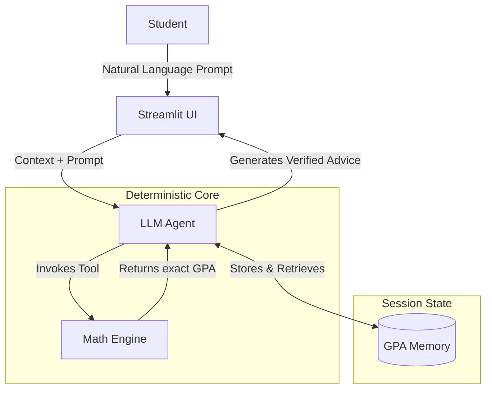

<div align="center">
  
  
  # GPA Advisor Agent 🎓
  
  **An AI-Powered Academic Trajectory Planner & Digital Transcript Metaphor**
  
  [](https://www.python.org/)
  [](https://streamlit.io/)
  [](https://plotly.com/)
  [](https://opensource.org/licenses/MIT)

  <h3>
    <a href="https://gpa-advisor.streamlit.app/">🔗 Try the Live Demo!</a>
  </h3>
</div>

<br/>

<details open>
  <summary><b>Table of Contents</b></summary>
  <ol>
    <li><a href="#-overview">Overview</a></li>
    <li><a href="#-key-features">Key Features</a></li>
    <li><a href="#-architecture">Architecture</a></li>
    <li><a href="#-getting-started">Getting Started</a></li>
    <li><a href="#-usage-examples">Usage Examples</a></li>
    <li><a href="#-author-information">Author Information</a></li>
  </ol>
</details>

---

## 📖 Overview

**GPA Advisor Agent** is an intelligent automation tool designed to help students track, calculate, and project their academic trajectory using a deterministic, memory-aware AI. By combining the natural language understanding of a Large Language Model (LLM) with strict mathematical tools, it provides highly accurate advice for academic planning, entirely eliminating the risk of AI hallucination when it comes to your grades.

---

## ✨ Key Features

| Feature | Description |
| :--- | :--- |
| 🧮 **Deterministic Math Engine** | Resolves the common LLM hallucination issue in arithmetic. It relies on deterministic Python tools like `add_grade()` and `compute_gpa()` to calculate exact credit-weighted GPAs based on the 10-point scale (O=10 to F=0). |
| 🧠 **Session Memory Tracking** | Powered by the `GPAMemory` class, the agent persistently stores recorded courses, grades, and credits across multi-turn dialogues. You don't need to repeat your transcript every time you ask a question! |
| 🎯 **Target Feasibility Check** | The agent calculates whether ambitious target GPAs are mathematically possible based on your current standing and remaining credits, returning explicit statuses (e.g., `ACHIEVABLE` or `Mathematically IMPOSSIBLE`). |
| 🎨 **Interactive UI** | A beautifully designed Streamlit interface employing classical academic iconography, available in *Oxford Paper* and *Cambridge Chalkboard* themes. |

---

## 🛠️ Architecture

The system forces the agent to ground its final advice strictly on verifiable tool results rather than "mental math".



---

## 🚀 Getting Started

### Prerequisites
- **Python:** 3.8 or higher
- **Package Manager:** pip

### Installation

1. **Clone the repository:**
   ```bash
   git clone https://github.com/RyanV-0407/GPA_ADVISOR.git
   cd GPA_ADVISOR
   ```

2. **Install dependencies:**
   ```bash
   pip install -r requirements.txt
   ```

3. **Set up environment variables:**
   Create a `.env` file in the root directory for any required API keys.
   ```env
   PROVIDER="groq"
   GROQ_API_KEY="your-api-key-here"
   ```

4. **Run the Application:**
   ```bash
   streamlit run app.py
   ```
   *The application will launch in your default web browser at `http://localhost:8501`.*

---

## 💬 Usage Examples

Once the app is running, try asking the agent questions like:

> *"I got an A in Data Structures (4 credits) and an O in Machine Learning (3 credits). Add them to my transcript."*

> *"What is my current GPA based on the courses I've told you about?"*

> *"I have 20 credits left in my degree. Can I reach a 9.0 final GPA if my current GPA is 8.5 over 60 credits?"*

---

## 👨‍🎓 Author Information

- **Name:** Vikram Singh Rathour
- **GitHub:** [RyanV-0407](https://github.com/RyanV-0407)

## 📄 License

This project is licensed under the MIT License - see the [LICENSE](LICENSE) file for details.

<br/>

<div align="center">
  <i>Built with determination to eliminate AI arithmetic hallucinations.</i>
</div>
